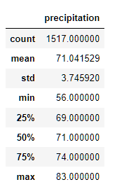
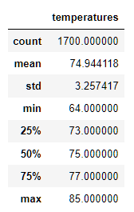
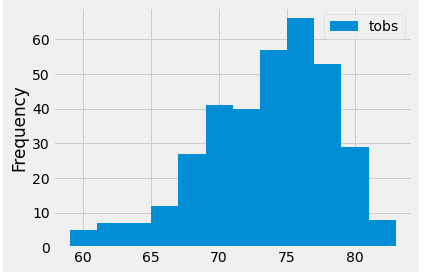
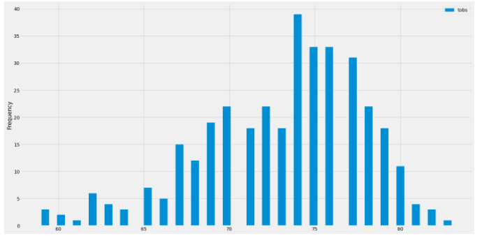
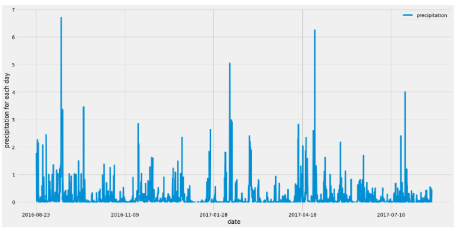

# surfs_up

## Overview of the analysis
The purpose of this project is to create reports from data gathered from various weather stations throughout the island of Hawaii. This data will help determine the feasibility of opening a surf shop on the island of Oahu.

## Results
- Oahu seems to have a fairly stable temperature year round regardless of if it is June or December. Average temperature varied by 4 degrees
- Min temperatures were slightly higher in June over December by about 8 degrees
- Max temperatures had even less variability of only 2 degrees.

Below are summary stats for December and June respectively:

## Summary
With such little temperature variation throughout the year Hawaii is the perfect place for outdoor recreation, with such a low standard deviation the temperature is stable year-round.  Preforming a query to get the precipitation by station for each station for June and December would be the next recommend eight queries to preform on this data set as the precipitation amount varied greatly throughout the year. Below is the precipitation by month, week and day respectively:

